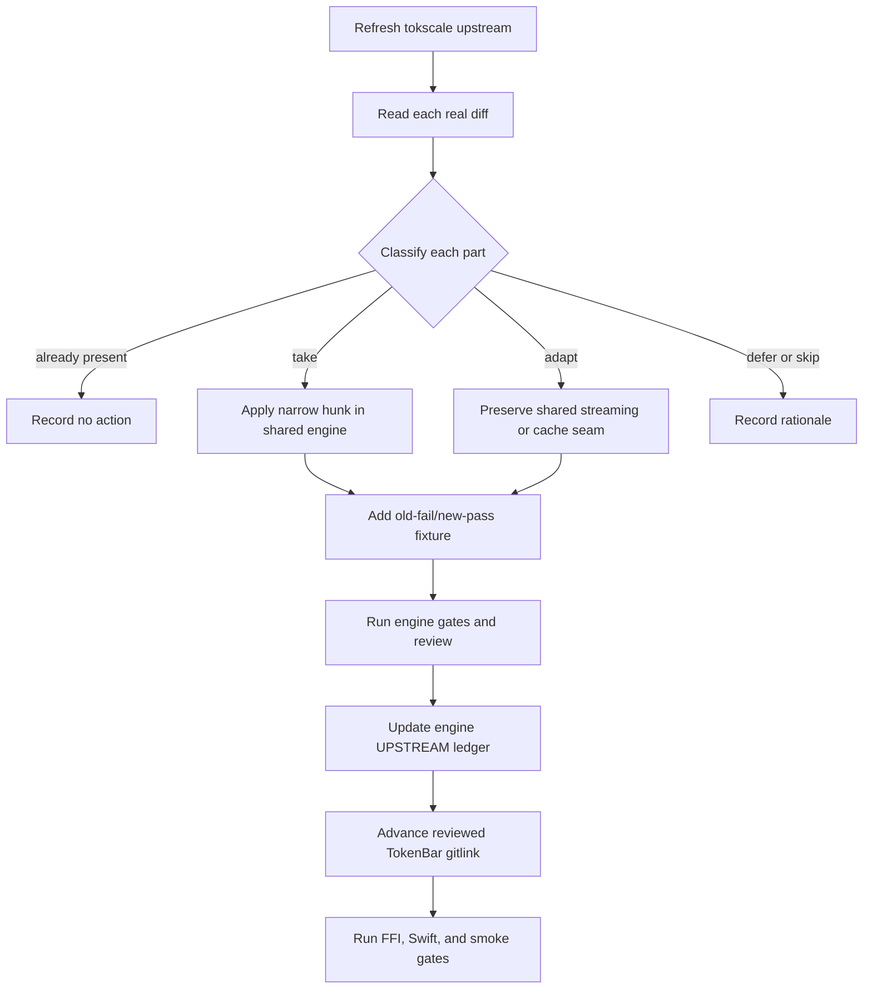

# Shared tokscale engine alignment

## 文件目的

TokenBar consumes the public [`tokscale-core`](https://github.com/Nanako0129/tokscale-core) engine through the pinned `vendor/tokscale-core` submodule. This document explains the consumer boundary and the method for safely aligning the shared engine. The exact upstream baseline, commit table, local patch table, and upstream report numbers for TokenBar's current reviewed pin live in the engine's immutable [`UPSTREAM.md`](https://github.com/Nanako0129/tokscale-core/blob/3eec58460543e6238785de2b19a13205b1ddcb05/UPSTREAM.md); [`vendor/README.md`](../../vendor/README.md) records TokenBar's source and pin. Newer engine work is not part of TokenBar until a separate consumer change advances that gitlink and passes the consumer gates.

## 目錄

- [Current boundary](#current-boundary)
- [Selective-port method](#selective-port-method)
- [Shared adaptation families](#shared-adaptation-families)
- [Schema and parser output](#schema-and-parser-output)
- [Sibling-source rule](#sibling-source-rule)
- [Upstream alignment](#upstream-alignment)
- [Handoff checklist](#handoff-checklist)

---

## Current boundary

The engine's true baseline is recorded in `tokscale-core/UPSTREAM.md`; the Cargo package version is not a reliable baseline marker. The shared tree contains upstream cherry-picks plus streaming, cache, report, pricing, and defensive adaptations extracted from TokenBar. TokenBar keeps its application-specific FFI, C ABI, Swift, and build wiring outside the submodule.

> **不要在 consumer branch 直接改 submodule source。** Shared Rust changes first land and pass review in `tokscale-core`; TokenBar then advances only the reviewed gitlink and runs its consumer gates. A clean build alone cannot prove that streaming or cache semantics were preserved.

Native 現在 pin reviewed engine commit `3eec58460543e6238785de2b19a13205b1ddcb05`，即 engine 的 `main`。本次推進帶進 **Codex 互動（turn）計數的修正**（engine [PR #26](https://github.com/Nanako0129/tokscale-core/pull/26)）。turn 偵測只認一種人類輸入載體，即 `event_msg` 底下 `payload.type == "user_message"`；Codex 約自 0.145 起改以 `event_msg` 的 `item_completed` 攜帶 `type` 為 `"UserMessage"` 的 `item` 回報同一段輸入，於是 `is_turn_start` 在近期 transcript 上從未被設起，Daily 與 Monthly 卡片的 Codex 互動幾乎全為 0。實測 2,407 份 rollout（2025-12 至 2026-09）：舊事件只殘存於 3 個檔，新載體則出現在 0.145.0-alpha.18 到 0.153.4 的每一個 vscode／exec／cli session，且兩者從未同時出現在同一個檔內。`payload.item` 以 `Option<Value>` 寬容承接而非強型別，因為 `CodexEntry` 是整行一次反序列化，任一欄位型別不符會讓整行被拒、落入 headless fallback，而該路徑會在 usage 檢查之前覆寫 `current_model` 並從行內任何 `usage` 物件生出 message——這是唯一能讓 turn 修正污染 token 的路徑。`parser_version(Codex)` 5→6，**這一步不可省**：`get` 只要版本相符就當快取命中，指紋未變的 rollout 永遠不會被重新 parse，修正對所有既有使用者將完全無效。`CACHE_FORMAT_VERSION` 維持 4——`CodexPayload` 只 derive `Deserialize`、從不寫進快取，序列化的 resume state 也未改動。⚠️ **既有使用者升級後會看到三件事**：Codex shard 重新 parse 一次且只影響 Codex namespace、升級後首次掃描明顯變慢、歷史 Codex 互動數字由 0 跳到數千。實測凍結語料 2,407 份 rollout：turn 由 25 升至 5,374，而 tokens 11,622,513,995、成本 $8,146.080494、messages 91,741 在全部 114 天**逐日位元相同**——動的是 turn 欄位，不是任何用量或金額，這也是使用者自行確認沒有被重算的最快方法。bump 的必要性以量測而非論證確立：先用舊 build 建好快取、再跑拿掉 bump 的同一修正，delta 為 **0**；同一顆 binary 對全新快取則得到 5,374。只跑冷快取的驗收會通過，卻出貨一個對存量使用者完全無效的修正。本次 consumer 是 pin-only，`crates/tb_core_ffi` 零改動、`ctb.h` 簽名不變。

前次推進帶進**定價 fallback 候選順序的決定性修正**（engine [PR #23](https://github.com/Nanako0129/tokscale-core/pull/23)，外部貢獻者 @huyanxius，對應 TokenBar issue #300）。同長度的 fallback 候選先前依 `HashMap` 的迭代順序取第一個，而該順序隨 pricing snapshot 重建而變，於是**同一筆用量在價格表重新載入後可能改用另一個費率，歷史費用在使用者沒有任何新用量的情況下自行變動**。現在長度降冪之後以字典序打破同長度 tie。回報者以固定的合成 catalog 與用量做 200 次隔離復現得到兩種結果（$10,000 共 117 次、$8,000 共 83 次）；修正後只會得到其中一個並保持不變。受影響的模型會**一次性**落到某個確定值後不再跳動——這不是重新計價，是停止隨機。此修正不動 parser 也不動 cache schema，`CACHE_FORMAT_VERSION` 維持 4、`parser_version` 全部不變，因此不觸發任何重掃或遷移。該次 consumer 同樣是 pin-only，`crates/tb_core_ffi` 零改動、`ctb.h` 簽名不變。

前次推進帶進 **#287 的 1h cache write 計價修正**（engine [PR #25](https://github.com/Nanako0129/tokscale-core/pull/25)）。Anthropic 對 prompt cache 寫入收兩種費率——5 分鐘 TTL 是 base input 的 1.25 倍、1 小時是 2 倍——而 parser 只讀兩者之和 `cache_creation_input_tokens`，全部按較便宜的 5m 費率計。現在 parser 讀巢狀的 `cache_creation.ephemeral_1h_input_tokens`，計價時把 1h 從 cache-write 桶**扣除**後以 `2 × input_cost_per_token` 重計；`cache_write` 仍是整筆寫入的總和，`cache_write_1h` 是其中的子集而非並列的桶，所以 `total()` 與所有總計站點都不動。`parser_version(Claude)` 3→4，這一步不可省：`get` 只要版本相符就當快取命中，指紋未變的 transcript 永遠不會被重新 parse，修正對所有既有使用者將完全無效。此 bump 落在可遷移區間，retained-only turn 由前次 pin 帶進的 migration 保住。

⚠️ **使用者會看到歷史成本上升。** 實測凍結 1,144 份 transcript 語料：1h 佔 cache-write token 的 79.6%（539,639,286／678,193,247），成本由 $14,658.23 升至 $15,710.35，**+7.18%**；四個 token lane 位元相同——這改的是 token 的價格，不是 token 的數量。量測刻意用**暖快取**（先跑舊 build 建立 parser_version 3 的快取，再用新 build 跑同一個 config dir），因為那才是使用者升級的實際情境；冷快取結果分毫不差，證明 bump 真的讓存量項重新 parse。把 bump 拿掉重跑暖快取會回到 $14,658.23，delta 恰為零——只跑冷快取的驗收會通過，卻出貨一個什麼都沒做的修正。發版說明必須解釋這次上升，否則會被當成計價變貴。

該次推進同樣是 pin-only：`crates/tb_core_ffi` 零改動（新欄位的填值在更前一次就做完了），`ctb.h` 簽名不變。

前次推進帶進 format-crossing migration（engine [PR #24](https://github.com/Nanako0129/tokscale-core/pull/24)），結案 tokscale-core issue #22：`CACHE_FORMAT_VERSION` 由 3 進到 4，而這是第一次 format bump 走遷移而非丟棄。`mod format3` 保留舊的 bincode layout，因此有 retention 的 namespace——Claude，其快取是 in-place compact 已抹去的 turn 的唯一副本——shard 會被解碼並帶過去；其餘 namespace 一如既往轉冷，各自重掃一次。**回報數字不變。**

這個 bump 的來由是同一個 PR 為 `TokenBreakdown` 加了 `cache_write_1h`，改變了 bincode 的 positional layout。該欄位只承載 layout，尚未填值也尚未計價，因此 #287 的 TTL 計價可以接著落地，不必再來一次有損的 bump。實測用同一份凍結的 1,144 份 transcript 語料，模擬 compact 抹去 300 個帶 usage 的 assistant turn（404 → 104）：format 4 讀 format 3 快取得到 input 868,733,624、output 44,261,347、cache_read 16,769,237,791、cache_write 289,163,123，四個 lane 與 format 3 基準完全相同；而同一份 compact 後語料的冷快取對照組則少了 input 376、output 121,248、cache_read 49,249,515、cache_write 573,038——該對照組是這個檢驗能夠失敗的證明。

該次推進**不是 pin-only**：`crates/tb_core_ffi` 改了一行，因為 `local_cost_estimate` 以窮盡形式建構 `TokenBreakdown` literal，必須指名新欄位。這不是 `ctb.h` 簽名變更；但 Windows 推進自己的 pin 時會需要同一行填值。

**該行現在填 `cache_write_1h: entry.cache_write`，不是 `0`**（TokenBar [PR #309](https://github.com/Nanako0129/TokenBar/pull/309)）。`ModelUsage` 沒有 1h 桶，所以這個估算必須自己假設一個，而唯一安全的假設是「整筆都是 1h」——較貴的那個。理由是方向不是大小：這個估算是 `implausibleCostRatio` 的**分母**，低估會膨脹比值、對本地算價的列捏造警告，高估只會壓低比值讓守衛安靜。原本填 `0`（全部以 5m 費率估）曾被以「7.18% 遠不觸及 50 倍門檻」為由認為安全，那個論證是錯的：provider hint 會把 `claude-haiku-4-5` 導到 `perplexity/anthropic/claude-haiku-4-5` 這個**沒有 `cache_creation_input_token_cost`** 的轉售條目（canonical key 有 1.25e-06；上游 tokscale #57），於是 5m 估算把整筆 cache write 丟掉，而 engine 仍以 `2 × input_cost_per_token` 收費。一列建立大量 prompt cache、input/output 餘量小、又無後續 cache read（session priming 完就結束的常見形狀）即可讓 `cost / costEstimate` 超過 50，在本地算價的列上顯示「費用由用戶端自行回報」。實測該條目費率下 100K input／10M cache write／無 cache read 得 0.10 對 20.10，即 201 倍。改以 1h 估算同時從源頭補上缺費率的洞，因為 1h 費率是由 `input_cost_per_token` 推導而非查表。真實拆分為 5m 時估算最多高 2.0 ÷ 1.25 = 1.6 倍，只會讓守衛更安靜。**Windows 推進 pin 時必須採用同樣的填法**；照舊填 `0` 會重現上述 false positive 並造成 cross-port drift。

前次推進帶進 Claude shard migration（engine [PR #21](https://github.com/Nanako0129/tokscale-core/pull/21)）：`parser_version` 2→3 的 bump 不再丟棄 retained-only turn，既有快取項改由 `retainable_history` 讀出，因此 **#288 的 tool_result 修正對存量快取生效**，而非只對下次變動的 transcript。實測：253 個 shard 走過遷移路徑、模擬 compact 抹去 329 個 assistant turn，遷移後四個 lane 與基準位元相同，冷快取對照組明顯較低。再前次推進的主因是 Claude `tool_result` 重複計數修正（engine [PR #19](https://github.com/Nanako0129/tokscale-core/pull/19)、issue #288，移植上游 `275bc798`）：**回報的 Claude input token 會下降，幅度依語料而異**（兩次獨立實測：貢獻者 6,219 份 transcript 由 118,834,152 降至 9,633,890，為 −91.9%；維護者 1,144 份 transcript 由 922,963,773 降至 868,733,624，為 −5.9%。絕對減少量同量級，比例差異來自 tool-heavy 程度不同；兩次量測中 output／cache_read／cache_write 皆位元相同）。（該修正出貨當時，既有快取項維持舊值直到各自 transcript 下次變動；前次 PR #21 的 migration 已解除該限制。）同一 pin 另含 Codex reasoning double-pricing 修正（歷史 Codex 數字依 reasoning effort 等比下降）、Syrtis remote source seam、immutable local source context、native Windows scan home，以及先前的 local-first graph pricing contract 與 embedded／partial cost provenance。此前 pin 擱淺在原型分支 `feat/excluded-scan-paths`，因為 `get_window_usage` 只存在於該分支、`crates/tb_core_ffi/src/window_usage.rs` 又依賴它；engine [PR #15](https://github.com/Nanako0129/tokscale-core/pull/15) 將該 commit 與 scanner exclusion commit 原封不動落上 `main` 後才解除。Windows 的現行 pin 由 Windows repository 的 gitlink與 consumer gates 擁有；本 Native pin 不重述或變更它。同 pin 只證明兩邊採用同一份 shared source，不構成 cross-port parity 主張，也不取代 cross-check 這道跨語言 gate；兩個 consumer 仍各自擁有 FFI、C header、Swift／C# bridge 與 build surfaces。Shared Rust changes land in the engine first；each consumer then advances its gitlink and runs its own app gates, while app-owned ABI changes are ported and independently cross-checked. See [`architecture.md`](architecture.md#windows-downstream-consumer) and the completed [`shared-rust-engine-extraction.md`](plans/shared-rust-engine-extraction.md).

### Grok attribution adoption

Public engine [PR #2](https://github.com/Nanako0129/tokscale-core/pull/2) merged at [`fd2f9167586c40a466c4570a466c2f03f6459e02`](https://github.com/Nanako0129/tokscale-core/commit/fd2f9167586c40a466c4570a466c2f03f6459e02). It fixes current Grok Build unified-log model attribution without hardcoding Grok 4.5：parent authority is isolated by PID generation, exact child authority is isolated by subagent session, and missing、malformed、cross-generation or conflicting evidence remains `grok-unknown`. A unique exact terminal event may fill only the matching earlier child inference；at that revision parent rows were never retroactively filled.

Follow-up engine [PR #3](https://github.com/Nanako0129/tokscale-core/pull/3) merged at [`84e0d66413d4e0d87b734f66f7a848b3bc323258`](https://github.com/Nanako0129/tokscale-core/commit/84e0d66413d4e0d87b734f66f7a848b3bc323258) and removes that parent-side gap. Because every authority was still built forward in file order, an inference row preceding the first model-bearing event for its own `(pid, generation)` stayed `grok-unknown` even when the same process later emitted unambiguous evidence and never restarted — the shape produced by any retained log window that begins mid-process. The prepass now also collects generation-scoped parent evidence, in pass two's own precedence, and pass two consults that generation's unique parent model as the last step before `grok-unknown`. Exact、child-scope and known-child-session authority are unchanged, evidence never crosses an `AuthManager::new` boundary, and conflicting evidence inside a generation still fails closed. The guard is unique **recorded** evidence rather than proof of history：a window that omits a process start record and hides a switch inside the unrecorded region attributes those earlier rows to the later model, which is the inference the existing session-unique legacy backfill already makes.

| Boundary | State |
|---|---|
| Cache identity | Grok parser identity advances `1 → 3` across the two adopted revisions（`1 → 2` in PR #2, `2 → 3` in PR #3）, so same-fingerprint parser-v1 and parser-v2 shards rebuild cold. Active `CACHE_FORMAT_VERSION` remains 2, other parser identities do not change, and the inert schema-32 monolith stays untouched. |
| Cost authority | Raw unified rows still have zero cost and `CostSource::Unknown`. Recovering an exact model only lets the existing post-cache pricing stage produce `Estimated`; it does not change provider-reported cost or usage totals. |
| Consumer adoption | Windows adopted this attribution revision in [PR #20](https://github.com/Nanako0129/TokenBar-Windows/pull/20), merge `eb3a7f3`; Native has since advanced independently to reviewed pin `3eec58460543e6238785de2b19a13205b1ddcb05`. |
| Presentation | TokenBar [issue #118](https://github.com/Nanako0129/TokenBar/issues/118) may group a recovered raw identity such as `grok-4.5-build` for display. Presentation aliases do not repair parser attribution and must not absorb `grok-unknown`. |
| Upstream status | [`junhoyeo/tokscale#849`](https://github.com/junhoyeo/tokscale/issues/849) remains open. Closed, unmerged [PR #924](https://github.com/junhoyeo/tokscale/pull/924) does not contain this current-schema attribution fix. |

The immutable implementation ledger for the Windows-adopted attribution revision remains [`UPSTREAM.md` at `84e0d66`](https://github.com/Nanako0129/tokscale-core/blob/84e0d66413d4e0d87b734f66f7a848b3bc323258/UPSTREAM.md); the current Native pin's exact engine ledger is [`UPSTREAM.md` at `3eec584`](https://github.com/Nanako0129/tokscale-core/blob/3eec58460543e6238785de2b19a13205b1ddcb05/UPSTREAM.md). The Windows consumer migration reviewed the complete engine delta from `b31e394` and ran its normal gates: hosted x64 and ARM64 builds, packaged-FFI, and the 119-case cross-check, plus a same-snapshot comparison in which `totalTokens` stayed byte-identical at 333,370,649 while the model bucket count moved 4 → 3. That adoption was limited to the reviewed gitlink advance, and so is the current pin: `crates/tb_core_ffi` is unchanged here, the one-line fill for the engine's `cache_write_1h` field having landed with the preceding advance. No app-owned ABI change travels with either and the `ctb.h` signature is unchanged, so the Windows port is not a notified consumer under that rule — but **advancing the Windows pin will still require that same one-line fill in its own FFI crate**, because the `TokenBreakdown` literal there is exhaustive too — and that fill is now `cache_write_1h: entry.cache_write`, not `0`; see the Current boundary section for why the direction of the error, not its size, is what makes `0` unsafe. Its crosscheck oracle pins the fixed macOS SHA `63084b2a` rather than `main`, so this advance cannot turn that job red; the oracle's own drift does grow, and advancing the Windows pin later will surface what accumulated in between.

## Selective-port method

| Step | Rule |
|---|---|
| Reference | Re-fetch and record the upstream commit being assessed; do not use a stale plan line number as evidence |
| Diff | Read the actual diff, including multipart commits whose title understates runtime changes |
| Port | Apply only the selected hunk in the shared engine repository; use context-aware patching and fail loudly on mismatch |
| Adapt | Keep shared streaming lanes, report filters, and cache identity explicit; keep TokenBar-only FFI mapping in `crates/tb_core_ffi` |
| Verify | Test parser output, cache rebuild, streaming behavior, and materialized parity in the engine before advancing a consumer |
| Record | Update the exact engine ledger, then pin the reviewed engine commit and run TokenBar's consumer gates |

## Shared adaptation families

| Family | Contract |
|---|---|
| Streaming reports | `scan_messages_streaming`, per-client dedup sets, cross-source authority selectors, `StreamingAggregator`, `SessionizeAccumulator`, and Agents report parity remain local seams |
| Cache | Fingerprints, mtime probes, topology-sensitive in-process report tokens, sibling dependencies, pruning exceptions, schema decisions, and cached attribution rebuilds are local until upstream has the same architecture |
| Pricing | Cache-rate backfill and refreshable pricing are local behavior; upstream cost-provenance ports must not erase them |
| FFI | Report client slices, hourly/Agents filtering, bounded totals, and thin mappers are TokenBar-specific consumers |
| Discovery | Cowork, local client lanes, and platform-specific scanner roots may be local even when the parser originates upstream |
| Defensive fixes | Saturating folds, placeholder-row removal, trace-scoped identity, malformed-input handling, and bounded Windows atomic-replacement retries require their own regression evidence |

## Schema and parser output

The shared engine owns its cache invalidation state. It is now **two** counters, not the single monolithic one this section used to name: `CACHE_FORMAT_VERSION` (global, currently **4**) covers the serialized storage layout and any cross-client type such as `UnifiedMessage`, and `parser_version(client)` (per client, Codex currently **6**) covers parse-semantics changes, so one client's correction cannot evict every other client's cached transcripts. The retired `CACHE_SCHEMA_VERSION` identifier no longer exists anywhere in the engine's `src/`; it survives only as history in the engine's `UPSTREAM.md`, which is where the schema-29 through schema-32 trail below belongs. Historical trail: M20 advanced 29 → 30 for OpenCode v2 hybrid databases, M15-B kept 30 for a new Kiro source, M16 advanced 30 → 31 because existing Codex, Claude, Copilot, Jcode, provider, and Antigravity outputs changed under unchanged source fingerprints, M19-A kept 31 because bounded Windows atomic replacement changes only write transport, and M17 kept 31 because its independently fingerprinted unified source selects authority after raw cache retrieval without changing legacy serialized output. M18 also kept 31: routed and long-context pricing is applied only after raw source-message cache retrieval, so model IDs, fingerprints, parser output, and serialized layout remain unchanged. M21/M25 kept 31 for new clients and post-cache grouping aliases. Do not mirror an upstream counter merely because the same upstream commit is being ported; both of ours are vendor-local state.

Which counter to advance, and when:

| Change | Advance |
|---|---|
| Serialized message fields, the bincode layout, or a cross-client type such as `UnifiedMessage` | `CACHE_FORMAT_VERSION` — every namespace's shards go stale at once |
| Parser output, dedup keys, attribution, or parser-resume state for one client, making that client's old cached values semantically stale | `parser_version(<client>)` — only that client rebuilds |
| A new independently fingerprinted source; post-cache pricing or report arithmetic; filesystem retry behaviour | neither |

A per-client bump is the default for a parser fix. Reaching for the global one because a parser changed evicts every other client's cached transcripts for no reason, and where a namespace has retention — Claude, whose cache is the only copy of turns an in-place compact has erased — a global bump can discard data that re-parsing cannot recover. Read the `parser_version` arm's own comment before advancing it; the Claude arm carries that warning in the code.

A parser-output change must include a same-fingerprint stale-cache regression. A test that only parses a fresh source does not prove that existing users receive the correction.

## Sibling-source rule

When a parser reads a primary file plus metadata, journal, history, or WAL sibling, treat the sibling as part of the source identity. The four required sites are:

| Site | Required behavior |
|---|---|
| Fingerprint | Include every sibling whose content can change parsed meaning |
| Active lane | Streaming and materialized consumers use the same fingerprint function |
| Mtime probe | Live tail sees sibling-only writes |
| Pruning | Modified-after scans retain sessions when a sibling is newer |

This rule applies to JSONL journals, Roo-family history, SQLite WAL files, Claude parent/workflow transcripts, and other secondary sources. A local adaptation is incomplete when only the parser or only the cache loader changes.

## Upstream alignment

The public rolling inventory is tracked in [issue #45](https://github.com/Nanako0129/TokenBar/issues/45). It is an inventory and decision surface, not a promise to clear every deferred capability. Correctness work is prioritized over new client breadth during maintenance. Every selected item must be re-evaluated against the current tokscale upstream head and current shared-engine tree before implementation.

The Copilot nested-agent bookkeeping in the engine's `UPSTREAM.md` records upstream issue [#879](https://github.com/junhoyeo/tokscale/issues/879) as closed and pull request [#880](https://github.com/junhoyeo/tokscale/pull/880) as merged (upstream commit `20d9096a68a40d4a4e83581b0e0dd308aadc5ab7`; GitHub PR merge commit `b7277d49a14ae905c17195be214d632e365b3ca6`). The exact merged diff has been compared with the M10-E hardening: its trace-scoped hierarchy and stale-cache rebuild semantics are equivalent, so no additional production or cache-schema port is needed. The assessment therefore closes as bookkeeping-only. This is no longer an external-upstream wait state; do not resurrect the superseded intermediate report when describing that status.

## Handoff checklist

| Question | Evidence |
|---|---|
| Is the selected upstream hunk present in the shared engine? | Exact file-level diff or stable patch comparison |
| Did a shared adaptation get overwritten? | Engine `UPSTREAM.md` local-patch table and targeted diff |
| Did parser output or attribution change? | Local schema decision plus stale-cache regression |
| Does a sibling source reach all consumers? | Fingerprint, lane, mtime, and prune tests |
| Does FFI expose a pre-aggregation filter? | C header, Rust mapper, Swift decoder, report parity fixture |
| Is the result still selective? | Focused engine fidelity note explaining included and excluded hunks, plus an exact reviewed consumer pin |
